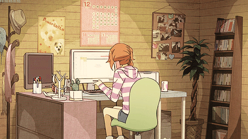

# Hey, hey, me chamo Jaqueline 👩‍💻

Ela / Dela · 29 anos · Trabalho remoto 🖥️

Sou desenvolvedora Front-end cursando Análise e Desenvolvimento de Sistemas pelo Senac São Paulo

### Ferramentas e tecnologias:

          

> **Atualmente estudando:**
>
> - TypeScript
> - Vue.js
> - Projeto atual: [Pokedex](https://github.com/jaaclaine/Pokedex)

### Contatos:

Portfolio: [jaaclaine.github.io](https://jaaclaine.github.io/)

 

<a href="https://github.com/jaaclaine">

